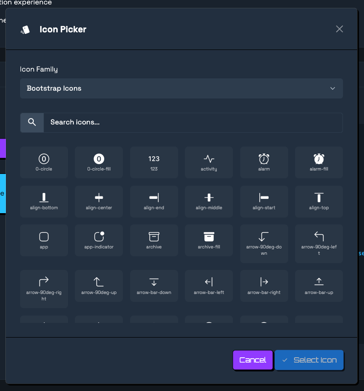
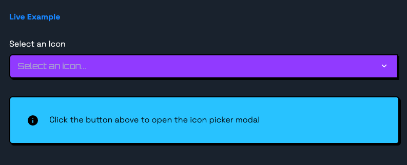

# HUI Icon Picker



Accessible, framework-agnostic icon picker delivered as a Web Component. Designed to pair with any icon font, included is [Bootstrap Icons](https://icons.getbootstrap.com/) and [Material Symbols Rounded](https://fonts.google.com/icons). You can easily add any other font / families you need however. 



## Quick Start

Install the package and the Bootstrap Icons font dependency:

```bash
npm install @huement/hui-icon-picker bootstrap-icons
```

Then load the component (bundlers and browsers without modules are both supported):

```javascript
import '@huement/hui-icon-picker/dist/hui-icon-picker.js';
```

Include the icon styles in your HTML:

```html
<link rel="stylesheet" href="https://cdn.jsdelivr.net/npm/bootstrap@5.3.3/dist/css/bootstrap.min.css" />
<link rel="stylesheet" href="https://cdn.jsdelivr.net/npm/bootstrap-icons@1.11.3/font/bootstrap-icons.min.css" />
<link rel="stylesheet" href="https://cdn.jsdelivr.net/npm/@material-symbols/font-rounded@0.14.3/material-symbols-rounded.min.css" />
```

Finally, drop the component onto the page:

```html
<hui-icon-picker></hui-icon-picker>
```

## Attributes & Properties

- `value` *(string)* – Stores the selection in the format `family:iconName`. Updates automatically when the user picks or clears an icon.
- `family` *(string)* – Sets the active family (`bootstrap` or `material`).
- `families` *(comma separated string)* – Restrict which families to expose. Example: `families="bootstrap"`.
- `label` *(string)* – Overwrites the trigger label (defaults to `Icon`).
- `placeholder` *(string)* – Text to show before a selection is made.
- `disabled` *(boolean attribute)* – Disables the trigger.

Every attribute is reflected as a JavaScript property (`picker.value`, `picker.family`, etc.).

## Events

- `icon-select` – Fired whenever the user chooses an icon. `event.detail` contains `{ family, name, preview }`.
- `icon-clear` – Fired when the selection is cleared.
- Standard `input` and `change` events also bubble for easy form integration.

The component is *form-associated*, so give it a `name` attribute and it will submit like a native input.

```html
<form>
  <hui-icon-picker name="icon" value="bootstrap:rocket"></hui-icon-picker>
</form>
```

## Styling & Theming

The picker uses CSS custom properties that you can override on the host element:

```css
hui-icon-picker {
  --hui-picker-accent: #ff6b6b;
  --hui-picker-border-radius: 16px;
  --hui-picker-icon-size: 2rem;
}
```

## Programmatic API

```javascript
const picker = document.querySelector('hui-icon-picker');
picker.openPicker(); // opens the modal
picker.selectIcon('rocket', 'bootstrap');
picker.clear();
```

Helper exports are available for custom integrations:

```javascript
import { ICON_FAMILIES, resolveFamilies } from '@huement/hui-icon-picker';
```

## Building Locally

```bash
npm install
npm run build
```

- `dist/hui-icon-picker.js` – UMD bundle with source maps
- `dist/hui-icon-picker.min.js` – Minified UMD bundle
- `dist/hui-icon-picker.d.ts` – Generated TypeScript definitions

Use `npm run watch` for live rebuilds and `npm run clean` to wipe all build outputs.

## Browser Support

The component targets evergreen browsers with Custom Elements, Shadow DOM, and `ElementInternals` support. Older browsers can be supported with Web Component polyfills.

## Come Check Us Out!

<div align="center">
  <a href="https://huement.com" target="_blank" rel="noreferrer">
    
  </a>
  <br/>
  <p>
    Crafted by the team at <a href="https://huement.com" target="_blank" rel="noreferrer">Huement</a>.
    Follow our engineering deep dives and product notes on the
    <a href="https://huement.blog" target="_blank" rel="noreferrer">Huement Blog</a>.
  </p>
</div>

## License

ISC © Huement
